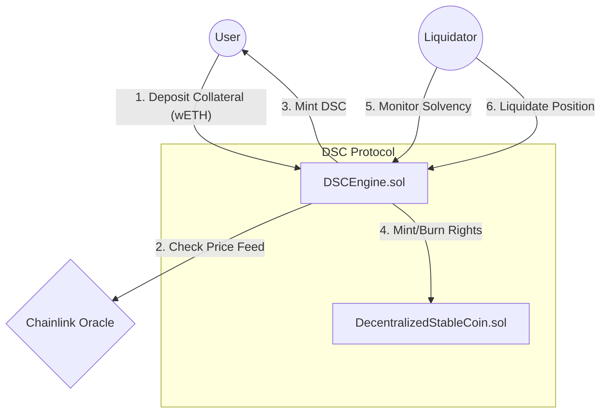

<div align="center">
  

  <br/>

  <p>
    <a href="https://github.com/NexTechArchitect/Foundry-Defi-StableCoin">
      
    </a>
    
    
    
    
    
  </p>

  <h3>🏛 The Decentralized StableCoin (DSC) Protocol</h3>
  <p width="80%">
    <b>An exogenous, autonomously governed, non-custodial stablecoin system.</b><br/>
    Anchored to the USD via real-time Chainlink Oracles and secured by a dynamic liquidation engine.
  </p>

  <br/>

  <p>
    <a href="#-system-architecture"><strong>🏗 Architecture</strong></a> •
    <a href="#-mathematical-proofs"><strong>🧮 Math Model</strong></a> •
    <a href="#-contract-interfaces"><strong>⚙️ Interface</strong></a> •
    <a href="#-invariant-properties"><strong>🛡 Security</strong></a> •
    <a href="#-risk-analysis"><strong>⚠️ Risk Analysis</strong></a>
  </p>

</div>

---

## 📖 Executive Summary

The **DSC Protocol** is designed to maintain a `$1.00` peg for the **DSC Token** without relying on centralized reserves (like USDC) or endogenous algorithm loops (like Terra).

The system operates on an **Over-Collateralization Model**, requiring users to deposit crypto-assets (wETH/wBTC) valued higher than the stablecoins they mint. Solvency is guaranteed by a decentralized network of liquidators who are incentivized to purge bad debt from the system.

---

## 🏗 System Architecture

The protocol adheres to a strict **Separation of Concerns (SoC)** design pattern. The logic (Engine) is decoupled from the state (Token).

### 📐 Data Flow Diagram



### 📂 Repository Structure

A modular "Monorepo" style structure optimized for Foundry.

```txt
Foundry-Defi-StableCoin/
├── 📂 src/
│   ├── ⚙️ DSCEngine.sol                # [CORE] The Logic Layer (Banking System)
│   ├── 🪙 DecentralizedStableCoin.sol  # [STATE] The ERC20 Implementation
│   └── 📚 libraries/                   # [LIBS]  OracleLib & Error Handling
├── 📂 script/
│   ├── 🚀 DeployDSC.s.sol              # [OPS]   Deployment Orchestration
│   └── 🔧 HelperConfig.s.sol           # [CONF]  Multi-chain Configuration
└── 📂 test/
    ├── 🧪 unit/                        # [TEST]  Function Isolation
    ├── 💥 fuzz/                        # [TEST]  Stateless Randomness
    └── 🔍 invariants/                  # [TEST]  Stateful System Properties

```

---

## 🧮 Mathematical Proofs

The stability of the DSC Protocol relies on the following mathematical invariants.

### 1. Health Factor (H_f)

The Health Factor determines if a user is solvent. If H_f < 1, the user is subject to liquidation.

Where:

* **Threshold**: The Liquidation Threshold (currently `50%`).
* **Price**: Real-time data from Chainlink Aggregator (1e8 precision).

### 2. Collateralization Ratio (C_r)

To mint 1 DSC, a user must provide value greater than the defined ratio.

### 3. Liquidation Bonus (L_b)

To incentivize liquidators to pay off bad debt, they receive a bonus cut of the collateral.

---

## ⚙️ Contract Interfaces

The system interaction is governed by the `DSCEngine`. Below are the core external entry points.

### 📥 Deposit & Minting

```solidity
/**
 * @notice Follows CEI (Checks-Effects-Interactions)
 * @param tokenCollateralAddress The address of the token to deposit as collateral
 * @param amountCollateral The amount of collateral to deposit
 * @param amountDscToMint The amount of decentralised stablecoin to mint
 */
function depositCollateralAndMintDsc(
    address tokenCollateralAddress,
    uint256 amountCollateral,
    uint256 amountDscToMint
) external;

```

### 🩸 Liquidation

```solidity
/**
 * @notice You can partially liquidate a user.
 * @notice You will get a liquidation bonus for taking the users funds.
 * @param collateral The erc20 collateral address to liquidate from the user
 * @param user The user who has broken the health factor. Their _healthFactor should be below MIN_HEALTH_FACTOR
 * @param debtToCover The amount of DSC you want to burn to improve the users health factor
 */
function liquidate(
    address collateral,
    address user,
    uint256 debtToCover
) external moreThanZero(debtToCover) nonReentrant;

```

---

## 🛡 Invariant Properties (Security)

This protocol was tested using **Foundry's Stateful Fuzzing**. The following invariants are mathematically proven to hold true across 10,000+ random transaction sequences.

| **Invariant ID** | **Property Description** | **Status** |
| --- | --- | --- |
| `INV_01` | **Protocol Solvency:** Total Collateral Value (USD) > Total DSC Supply. | ✅ **PASS** |
| `INV_02` | **Getter Safety:** View functions (`getAccountInformation`) never revert. | ✅ **PASS** |
| `INV_03` | **Ledger Integrity:** `wETH` in contract == Sum of all User Balances. | ✅ **PASS** |
| `INV_04` | **Oracle Reliability:** Stale price feeds cause immediate transaction reversion. | ✅ **PASS** |

### 🔍 Audit Scope

* **Static Analysis:** Slither, Aderyn.
* **Dynamic Analysis:** Fuzzing (Foundry), Differential Testing.
* **Manual Review:** Access Control, Reentrancy, Oracle Manipulation.

---

## ⚠️ Risk Analysis & Mitigation

| **Risk Vector** | **Mitigation Strategy** |
| --- | --- |
| **Oracle Failure** | Protocol freezes if Chainlink heartbeat is missed or price deviates >50% instantly. |
| **De-pegging** | Arbitrage opportunity created via `redeem` function ensures market price returns to $1. |
| **Network Congestion** | Liquidation threshold set conservatively (200%) to allow time for tx inclusion. |
| **Smart Contract Bug** | Contract is immutable and non-upgradeable to prevent governance attacks. |

---

<div align="center">


<h3>Engineered by NexTechArchitect</h3>
<p><i>Protocol Design • DeFi Architecture • Security Engineering</i></p>


<a href="https://github.com/NexTechArchitect">

</a>
<a href="https://linkedin.com/in/amit-kumar-811a11277">

</a>
<a href="https://www.google.com/search?q=https://twitter.com/itZ_AmiT0">

</a>
</div>

```

```
