<div align="center">


<p align="center">
  <a href="https://github.com/NexTechArchitect/ERC4337-Account-Abstraction-Foundry">
    
  </a>
  <a href="https://github.com/NexTechArchitect/ERC4337-Account-Abstraction-Foundry">
    
  </a>
  <a href="https://eips.ethereum.org/EIPS/eip-4337">
    
  </a>
</p>

<h3>🛡️ The Next Generation of Ethereum Accounts</h3>
<p width="80%">
  <b>A low-level, protocol-accurate implementation of Account Abstraction.</b><br/>
  Built to expose the internal mechanics of UserOperations, Bundlers, and Paymaster gas sponsorship.
</p>

</div>

---

## 📑 Table of Contents

- [🧠 Executive Summary](#-executive-summary)
- [📚 Protocol Architecture](#-protocol-architecture)
- [⚙️ The ERC-4337 Standard](#-the-erc-4337-standard)
- [🏗️ Transaction Lifecycle](#-transaction-lifecycle)
- [📂 Modular Structure](#-modular-structure)
- [🧩 Key Components](#-key-components)
- [🚀 Usage & Simulation](#-usage--simulation)
- [🛠️ Tech Stack](#-tech-stack)
- [⚠️ Disclaimer](#-disclaimer)

---

## 🧠 Executive Summary

This repository contains a **ground-up implementation of ERC-4337**, designed for engineers who need to understand the protocol beyond simple SDKs.

**Core Engineering Goals:**
- 📦 **Manual Packing:** Constructing `UserOperations` from raw bytes.
- 🔐 **Cryptographic Verification:** Implementing `validateUserOp` with ECDSA recovery.
- ⛽ **Gas Abstraction:** Building a functional **Paymaster** to sponsor transactions.
- 🔄 **Alt-Mempool Logic:** Simulating how Bundlers handle operations before they hit the chain.

> This project mirrors the exact logic used by production wallets (Argent, Safe) and bundlers (Pimlico, Stackup) using the latest **v0.7** standards.

---

## 📚 Protocol Architecture

**Account Abstraction (AA)** decouples the object holding your tokens (Account) from the object authorized to move them (Signer).

| Feature | Traditional EOA | 🛡️ Smart Account (AA) |
| :--- | :--- | :--- |
| **Logic** | Hardcoded (ECDSA only) | **Programmable** (Any Logic) |
| **Recovery** | Seed Phrase (Single Point of Failure) | **Social Recovery** (Guardians) |
| **Gas Payment** | ETH Only | **ERC-20 / Sponsored** |
| **UX** | One Tx per Action | **Batched Transactions** |
| **Security** | All-or-Nothing Access | **Session Keys / Scoped Access** |

---

## ⚙️ The ERC-4337 Standard

ERC-4337 achieves AA **without a hard fork** by introducing a higher-layer pseudo-transaction object called a `UserOperation`.

1.  **Alternative Mempool:** UserOps avoid the standard Ethereum mempool.
2.  **The Bundler:** A specialized node that packages UserOps into a standard transaction.
3.  **The EntryPoint:** A singleton contract ensuring validation rules are strictly followed to prevent DoS attacks.

---

## 🏗️ Transaction Lifecycle

The flow below illustrates how a UserOperation travels from the client to on-chain execution.

```mermaid
graph TD
    User[👤 Client / User] -->|Sign Off-Chain| UserOp[📦 UserOperation]
    UserOp -->|Submit| Bundler[🤖 Bundler Node]
    Bundler -->|Batch Call| EP[🏛️ EntryPoint Contract]
    
    subgraph On-Chain Execution
    EP -->|1. Validate Sig| SA[🛡️ Smart Account]
    EP -->|2. Validate Paymaster| PM[⛽ Paymaster]
    EP -->|3. Execute Call| SA
    SA -->|4. Action| Target[🎯 Target Protocol]
    end

    style User fill:#1a1a1a,stroke:#b298dc
    style Bundler fill:#1a1a1a,stroke:#b298dc
    style EP fill:#2d1b4e,stroke:#9d4edd,stroke-width:2px
    style SA fill:#1a1a1a,stroke:#fff
    style PM fill:#1a1a1a,stroke:#fff

```



---

## 📂 Modular Structure

Designed for clarity and separation of concerns via Foundry.

```text
src/
├── account/
│   ├── SmartAccount.sol        # Core Wallet Logic (Validate + Execute)
│   └── SessionKeyManager.sol   # Module for Delegated Permissions
├── paymaster/
│   └── SimplePaymaster.sol     # Gas Sponsorship Logic
├── core/
│   └── EntryPoint.sol          # (Reference) Protocol Coordinator
├── utils/
│   └── PackedUserOpLib.sol     # Byte packing helpers
script/
├── Deploy.s.sol                # Deployment Orchestration
└── SimulateBundler.s.sol       # UserOp Construction & Submission

```

---

## 🧩 Key Components

### 1. SmartAccount

Implements `IAccount`. It defines **WHO** can move funds.

* **Validation:** Verifies the `UserOp.signature` matches the owner.
* **Execution:** `execute(dest, value, data)` allows interaction with any EVM contract.

### 2. Session Keys (`SessionKeyManager`)

A security module enabling temporary, restricted access.

* **Use Case:** Allow a game to sign transactions for 1 hour without asking for the user's master key every time.

### 3. Paymaster

Implements `IPaymaster`. It defines **WHO PAYS** for gas.

* **Flow:** The Paymaster deposits ETH into the EntryPoint. The EntryPoint deducts gas costs from this deposit instead of the user's wallet.

---

## 🚀 Usage & Simulation

We use **Foundry Scripts** to act as the Bundler.

### 1. Installation

```bash
git clone [https://github.com/NexTechArchitect/ERC4337-Account-Abstraction-Foundry.git](https://github.com/NexTechArchitect/ERC4337-Account-Abstraction-Foundry.git)
cd ERC4337-Account-Abstraction-Foundry
forge install

```

### 2. Build & Test

```bash
forge build
forge test

```

### 3. Run the "Bundler" Simulation

This script deploys the environment, creates a wallet, signs a UserOp, and submits it.

```bash
make deploy

```

*(See `Makefile` for detailed command breakdowns)*

---

## 🛠️ Tech Stack & References

* **[Foundry](https://book.getfoundry.sh/)**: Development Framework.
* **[ERC-4337 Specs](https://eips.ethereum.org/EIPS/eip-4337)**: Official Standard.
* **[Solady / OpenZeppelin](https://www.google.com/search?q=https://github.com/Vectorized/solady)**: Optimized Assembly & Cryptography.

---

## ⚠️ Disclaimer

This codebase is for **educational and architectural research**.
While it adheres to the v0.7 standard, production usage requires a formal audit and integration with a live Bundler network (e.g., Alchemy, Pimlico).

---

<div align="center">
<b>Architected with 💜 by NEXTECHARHITECT</b>


<i>Protocol Security • EVM Architecture • Foundry</i>


<a href="https://github.com/NexTechArchitect">GitHub</a> •
<a href="https://www.google.com/search?q=https://twitter.com/NexTechArchitect">Twitter</a>
</div>

<div align="center">

</div>

```

```
