<div align="center">

  <br />
  <br />

  

  <h1 style="font-size: 3rem; margin-bottom: 0;">Decentralized StableCoin Engine</h1>

  <p style="font-size: 1.1rem; color: #b298dc; max-width: 600px;">
    <strong>A mathematically modeled, exogenous, over-collateralized stablecoin system.</strong><br/>
    Anchored to the USD via Chainlink Oracles and secured by a dynamic liquidation engine.
  </p>

  <p>


</div>

---

## 📑 Table of Contents

- [🧠 Executive Summary](#-executive-summary)
- [🏗️ System Architecture](#-system-architecture)
- [⚙️ Core Mechanics](#-core-mechanics)
- [🧮 Mathematical Model](#-mathematical-model)
- [🛡️ Invariant Security](#-invariant-security)
- [🚀 Usage & Testing](#-usage--testing)
- [⚠️ Disclaimer](#-disclaimer)

---

## 🧠 Executive Summary

The **DSC Protocol** maintains a strict `$1.00` peg for the **DSC Token** through a decentralized, censorship-resistant mechanism. Unlike centralized stablecoins (USDC) or purely algorithmic models (Terra/UST), DSC relies on verifiable on-chain collateral.

> **Core Philosophy:** **Over-Collateralization**
> Users must deposit crypto-assets (`wETH` / `wBTC`) valued significantly higher than the stablecoins they mint. System solvency is enforced by a network of liquidators who profit from purging under-collateralized positions.

---

## 🏗️ System Architecture

This diagram illustrates the **Flow of Value** through the system. We utilize a **Hub-and-Spoke** architecture where the `DSCEngine` acts as the central, non-custodial controller.

```mermaid
graph TD
    User((👤 User))
    Liquidator((🩸 Liquidator))
    Engine[⚙️ DSC Engine Contract]
    Oracle{👁️ Chainlink Price Feed}
    Collateral[🏦 WETH / WBTC Vault]
    Token[💵 DSC Token]

    %% User Flow
    User ==>|1. Deposit Collateral| Engine
    Engine ==>|2. Lock Funds| Collateral
    Engine -.->|3. Check USD Price| Oracle
    Engine ==>|4. Mint DSC| Token
    Token ==>|5. Transfer DSC| User

    %% Liquidator Flow
    Liquidator -.->|6. Monitor Health Factor| Engine
    Liquidator ==>|7. Liquidate Insolvent User| Engine
    
    style Engine fill:#2d1b4e,stroke:#9d4edd,stroke-width:2px
    style Oracle fill:#1a1a1a,stroke:#b298dc
    style Collateral fill:#1a1a1a,stroke:#fff

```



### Component Breakdown

| Contract | Responsibility |
| --- | --- |
| **`DSCEngine.sol`** | The "Brain". Handles deposits, minting, burning, and liquidation logic. Enforces the Health Factor. |
| **`DecentralizedStableCoin.sol`** | The "Currency". An ERC20 Burnable/Mintable token. Owned and controlled exclusively by the Engine. |
| **`OracleLib.sol`** | Safety wrapper. Checks for stale prices and heartbeat timeouts to prevent bad data usage. |

---

## ⚙️ Core Mechanics

### 1. Minting & Borrowing

Users deposit specific allowed collateral (WETH/WBTC) and mint DSC against it.

* **Collateral Threshold:** 200%
* **Example:** To mint **$100 DSC**, you must deposit at least **$200 worth of ETH**.

### 2. The Liquidation Engine

If the value of your collateral drops (ETH price crash), your **Health Factor** may fall below 1.

* **Trigger:** Health Factor < 1.0e18.
* **Incentive:** Liquidators pay off your debt (burn DSC) and seize your collateral.
* **Bonus:** Liquidators receive a **10% Bonus** on the collateral they seize, creating a profit arbitrage.

---

## 🧮 Mathematical Model

The protocol's stability is guaranteed by strict mathematical invariants enforced at the smart contract level.

### 1. Health Factor ()

The primary metric for solvency. If , the user is legally "broken" in the system.

### 2. Solvency Invariant

The system prevents minting if it would break the global solvency rule:
$$ \sum \text{Collateral Value} > \sum \text{Total Supply DSC} $$

---

## 🛡️ Invariant Security

This protocol has undergone rigorous **Stateful Fuzzing** using Foundry. The following properties are mathematically proven to hold across **10,000+ random transaction sequences**.

| ID | Invariant Property | Status |
| --- | --- | --- |
| **INV_01** | **Protocol Solvency:** Total Collateral Value is *always* greater than Total DSC Supply. | ✅ **PASS** |
| **INV_02** | **Getter Safety:** View functions never revert, ensuring liquidators can always query state. | ✅ **PASS** |
| **INV_03** | **Oracle Reliability:** Stale/Broken price feeds cause safe revert (DoS) rather than bad pricing. | ✅ **PASS** |

---

## 🚀 Usage & Testing

We employ a 3-layered testing approach (Unit, Fuzz, Invariant).

### Prerequisites

* [Foundry](https://github.com/foundry-rs/foundry)
* [Git](https://git-scm.com/)

### Installation

```bash
git clone [https://github.com/NexTechArchitect/Foundry-Defi-StableCoin.git](https://github.com/NexTechArchitect/Foundry-Defi-StableCoin.git)
cd Foundry-Defi-StableCoin
forge install

```

### Running Tests

```bash
# Run Unit Tests
forge test

# Run Invariant (Stateful) Fuzzing
forge test --match-test invariant

```

---

<div align="center">


<b>Engineered by NEXTECHARHITECT</b>


<i>Protocol Design · DeFi Architecture · Security Engineering</i>


<a href="https://github.com/NexTechArchitect">GitHub</a> •
<a href="https://www.google.com/search?q=https://twitter.com/NexTechArchitect">Twitter</a>
</div>

```

```
